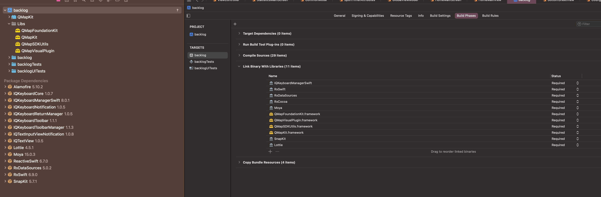
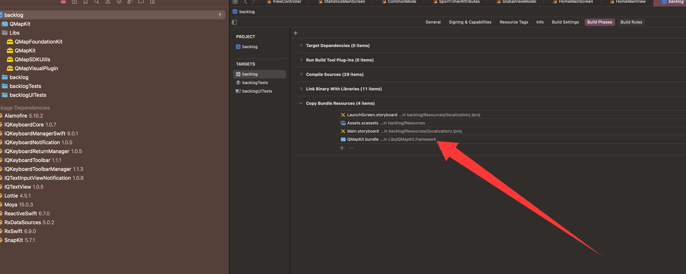
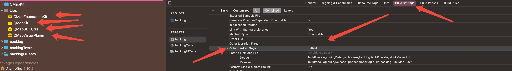

# iOS 对接腾讯地图文档

## 1. 获取腾讯地图 SDK

1. 前往 [腾讯位置服务官网](https://lbs.qq.com/) 注册并申请应用。
2. 获取 `AppKey`，用于 SDK 初始化。

## 2. 集成 SDK

### 手动集成

1. 下载 [iOS SDK](https://lbs.qq.com/mobile/iOSMapSDK/mapDownload/download3D)。
2. 将 SDK 文件拖入 Xcode 项目。

## 3. 配置 Info.plist

添加以下权限：

```xml
<?xml version="1.0" encoding="UTF-8"?>
<!DOCTYPE plist PUBLIC "-//Apple//DTD PLIST 1.0//EN" "http://www.apple.com/DTDs/PropertyList-1.0.dtd">
<plist version="1.0">
<dict>
	<key>BGTaskSchedulerPermittedIdentifiers</key>
	<array>
		<string>com.coder.backlog</string>
	</array>
	<key>UIBackgroundModes</key>
	<array>
		<string>location</string>
	</array>
	<key>NSAppTransportSecurity</key>
	<dict>
		<key>NSExceptionDomains</key>
		<dict>
			<key>vectorsdk.map.qq.com</key>
			<dict>
				<key>NSIncludesSubdomains</key>
				<true/>
				<key>NSExceptionAllowsInsecureHTTPLoads</key>
				<true/>
			</dict>
		</dict>
	</dict>
	<key>NSLocationWhenInUseUsageDescription</key>
	<string>App 需要在后台持续访问您的位置，用于记录运动轨迹。</string>
	<key>NSLocationAlwaysUsageDescription</key>
	<string>App 需要后台定位以持续跟踪用户位置，用于记录运动轨迹。</string>
	<key>UIApplicationSceneManifest</key>
	<dict>
		<key>UIApplicationSupportsMultipleScenes</key>
		<false/>
		<key>UISceneConfigurations</key>
		<dict>
			<key>UIWindowSceneSessionRoleApplication</key>
			<array>
				<dict>
					<key>UISceneConfigurationName</key>
					<string>Default Configuration</string>
					<key>UISceneDelegateClassName</key>
					<string>$(PRODUCT_MODULE_NAME).SceneDelegate</string>
					<key>UISceneStoryboardFile</key>
					<string>Main</string>
				</dict>
			</array>
		</dict>
	</dict>
</dict>
</plist>

```

## 4. 初始化 SDK

在 `AppDelegate` 中：

```swift
import QMapKit

func application(_ application: UIApplication, didFinishLaunchingWithOptions launchOptions: [UIApplication.LaunchOptionsKey: Any]?) -> Bool {
  QMapServices.shared().apiKey = "你的AppKey"
  QMapServices.shared().setPrivacyAgreement(true)
  return true
}
```

## 5. 显示地图

```swift
import QMapKit

let mapView = QMapView(frame: self.view.bounds)
self.view.addSubview(mapView)
```

## 6. 常用功能

- 地图定位
- 路径规划
- 地点搜索

详细 API 参考 [腾讯地图 iOS 开发文档](https://lbs.qq.com/mobile/iOSMapSDK/mapGuide/summary)。

## 7. 注意事项

- 确保已开启定位权限。
- 发布前需在腾讯地图后台配置 Bundle Identifier。
  
  
  
